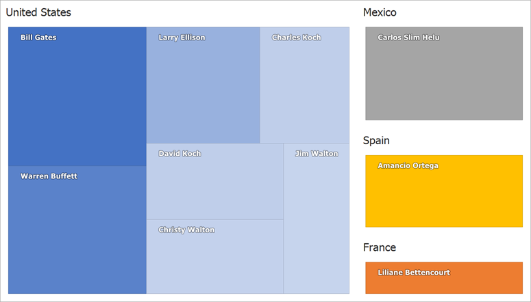

# TreeMap for WinForms - Load Flat Data

This example demonstrates how to visualize flat data in a treemap and paint its cells with a gradient fill.

* To load data from a two-dimensional source to a treemap, create a [TreeMapFlatDataAdapter](https://docs.devexpress.com/WindowsForms/DevExpress.XtraTreeMap.TreeMapFlatDataAdapter) object and assign it to the [TreeMapControl.DataAdapter](https://docs.devexpress.com/WindowsForms/DevExpress.XtraTreeMap.TreeMapControl.DataAdapter) property.

* Use the [TreeMapFlatDataAdapter.DataSource](https://docs.devexpress.com/WindowsForms/DevExpress.XtraTreeMap.TreeMapFlatDataAdapter.DataSource) property to specify an object that contains data items.

* Specify the [TreeMapFlatDataAdapter.ValueDataMember](https://docs.devexpress.com/WindowsForms/DevExpress.XtraTreeMap.TreeMapFlatDataAdapter.ValueDataMember) and [TreeMapFlatDataAdapter.LabelDataMember](https://docs.devexpress.com/WindowsForms/DevExpress.XtraTreeMap.TreeMapFlatDataAdapter.LabelDataMember) properties to define data members that contain treemap cell values and labels.

* Define the [TreeMapFlatDataAdapter.GroupDataMembers](https://docs.devexpress.com/WindowsForms/DevExpress.XtraTreeMap.TreeMapFlatDataAdapter.GroupDataMembers) property to specify a data member (or data members) those values are used to group treemap cells.

* Initialize the [TreeMapControl.Colorizer](https://docs.devexpress.com/WindowsForms/DevExpress.XtraTreeMap.TreeMapControl.Colorizer?p=netframework) property with a [TreeMapGroupGradientColorizer](https://docs.devexpress.com/WindowsForms/DevExpress.XtraTreeMap.TreeMapGroupGradientColorizer?p=netframework) object to paint treemap cells so that each cell group has the same color.

* Use the [TreeMapPaletteColorizerBase.Palette](https://docs.devexpress.com/WindowsForms/DevExpress.XtraTreeMap.TreeMapPaletteColorizerBase.Palette) property to select a palette. The [TreeMapGroupGradientColorizer](https://docs.devexpress.com/WindowsForms/DevExpress.XtraTreeMap.TreeMapGroupGradientColorizer?p=netframework) consequently obtains colors from the palette and assigns them to treemap cell groups.

* Specify the [TreeMapGroupGradientColorizer.Max](https://docs.devexpress.com/WindowsForms/DevExpress.XtraTreeMap.TreeMapGroupGradientColorizer.Max) and [TreeMapGroupGradientColorizer.Min](https://docs.devexpress.com/WindowsForms/DevExpress.XtraTreeMap.TreeMapGroupGradientColorizer.Min) properties to define the color intensity for treemap cells with maximum and minimum values.

* Set the [TreeMapGroupGradientColorizer.GradientColor](https://docs.devexpress.com/WindowsForms/DevExpress.XtraTreeMap.TreeMapGroupGradientColorizer.GradientColor) property to specify a color that is blended with the cell color.

## Files to Look At

* [Form1.cs](./CS/FlatDataAdapterSample/Form1.cs) (VB: [Form1.vb](./VB/FlatDataAdapterSample/Form1.vb))
* [BillionaireInfo.cs](./CS/FlatDataAdapterSample/BillionaireInfo.cs) (VB: [BillionaireInfo.vb](./VB/FlatDataAdapterSample/BillionaireInfo.vb))

## Documentation

* [TreeMap Control - Providing Data](https://docs.devexpress.com/WindowsForms/115742/controls-and-libraries/treemap/providing-data)

## More Examples

* [How to: Manually Populate TreeMap with Data](https://github.com/DevExpress-Examples/how-to-manually-populate-treemap-with-data-t360867)
* [How to: Provide Hierarchical Data to TreeMap](https://github.com/DevExpress-Examples/how-to-provide-hierarchical-data-to-treemap-t360961)
